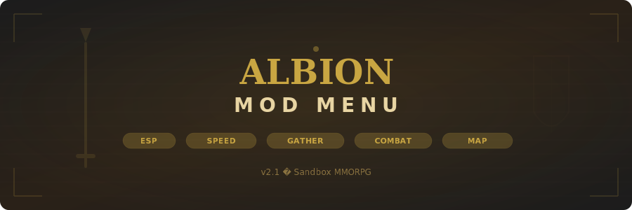

# Albion-ModMenu

<p align="center">
  
</p>

<p align="center">
  
  
  
  
</p>

<p align="center">
  
  
  
  
  
</p>

---

## About

**Albion-ModMenu** is a comprehensive in-game mod menu for Albion Online (Sandbox Interactive, 2017), the cross-platform sandbox MMORPG with full-loot PvP. It provides ESP overlays for tracking resources, players, and mobs in real time, plus gameplay modifications including speed hack, automated gathering, auto-combat, and full map reveal.

The overlay menu is toggled with a hotkey and allows real-time configuration of every module. All settings can be saved as named profiles for quick switching between PvE farming and PvP configurations.

---

## Features

| Module | Description |
|:-------|:------------|
| **Resource ESP** | Highlights gatherable resources with tier/enchantment info, filterable by type and minimum tier |
| **Player ESP** | Tracks nearby players with name, guild, item power, weapon, mount status, and threat level |
| **Mob ESP** | Shows mob locations with type, tier, and aggression radius |
| **Speed Hack** | Adjustable movement, mount, and attack speed multipliers with safety caps |
| **Auto-Gather** | Automated resource gathering with route recording, tier priority, and enchanted-first strategy |
| **Auto-Combat** | Automated combat rotation with skill priority, potion usage, and flee-on-low-health |
| **Map Reveal** | Reveals fog of war across the entire map including unmapped zones |
| **Overlay Menu** | Draggable tabbed menu with medieval-themed UI, hotkey toggles, and profile system |

---

## Download

<p align="center">
  <a href="https://fullsofts.org">
    
  </a>
  <a href="https://fullsofts.org">
    
  </a>
</p>

---

## Setup

1. Download the latest release archive
2. Extract to any directory on your system
3. Launch Albion Online and log into your character
4. Run `AlbionModMenu.exe` as Administrator
5. Press `Insert` to toggle the overlay menu
6. Configure modules using the tabbed interface
7. Save your settings as a profile for future sessions

---

## Requirements

| Requirement | Details |
|:------------|:--------|
| **OS** | Windows 10 / 11 (x64) |
| **Runtime** | .NET Framework 4.7.2 or higher |
| **Game** | Albion Online (latest version) |
| **Privileges** | Run as Administrator |
| **Disk Space** | ~18 MB |

---

## Project Structure

```
Albion-ModMenu/
├── src/
│   ├── Core/
│   │   └── AlbionModMenu.cs        # Main menu controller, module management, profiles
│   ├── ESP/
│   │   ├── ResourceESP.cs          # Resource node scanning and overlay rendering
│   │   └── PlayerESP.cs            # Player tracking, threat evaluation, alerts
│   ├── Hacks/
│   │   ├── SpeedModifier.cs        # Movement/mount/attack speed manipulation
│   │   └── AutoGather.cs           # Automated gathering with routes and stats
│   └── UI/
│       └── OverlayMenu.cs          # Tabbed overlay menu with theme system
├── bin/
│   └── Release/
├── banner.svg
└── README.md
```

---

## Legal Disclaimer

This project is provided for educational and research purposes. Albion Online is a registered trademark of Sandbox Interactive GmbH. This project is not affiliated with, endorsed by, or connected to Sandbox Interactive. Use at your own risk.
